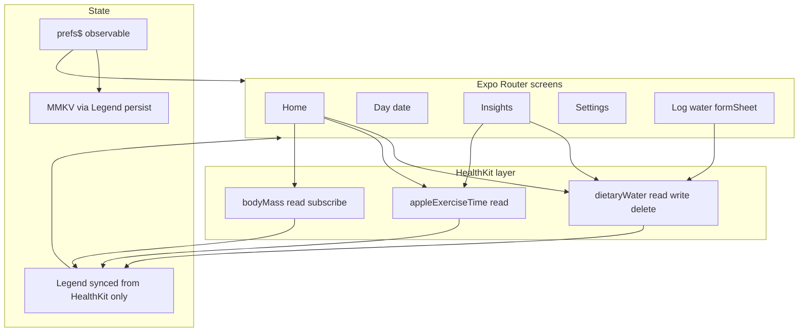

# Quench replication plan (quench-new)

## Current baseline

- [package.json](package.json): Expo SDK 54, RN 0.81, **New Architecture enabled** in [app.json](app.json) (`newArchEnabled: true`), Expo Router, no HealthKit or data layer yet.
- [app/\_layout.tsx](app/_layout.tsx): Root `Stack` with hidden-header `(tabs)` + `modal` — will be **replaced** by an app-group stack (no bottom tabs for main IA).
- Path alias `@/*` is already configured in [tsconfig.json](tsconfig.json).

## Architecture (high level)

- **Single volume unit everywhere**: one field on **`prefs$`** (e.g. `ml | fl-oz | cup | us-pint`) and a small **`lib/volume/`** module: internal math in a **fixed base** (recommend **US fluid ounces** to match the original [`quench/utils.ts`](file:///Users/jonstuebe/code/personal/quench/utils.ts) HealthKit usage), plus `format()`, `toDisplay()`, `pickerOptions()` so Home, Day, Insights, Settings, and the log sheet never diverge.

## App preferences (`prefs$` + MMKV, no Context)

- Define **one** (or a small number of) **`observable({ ... })`** holding: onboarding complete, name, volume **unit**, bedtime, wake, reminder interval, log increment, etc.
- Call **`syncObservable(prefs$, { persist: { name: 'quench-prefs', plugin: ObservablePersistMMKV } })`** per [Persist and Sync](https://legendapp.com/open-source/state/v3/sync/persist-sync/) — MMKV is the storage engine; Legend handles load/merge and writes.
- **Screens import `prefs$`** and read with **`useValue(() => prefs$.unit.get())`** (or `observer`) — **no `React.createContext` for settings**. Optionally `await when(syncState(prefs$).isPersistLoaded)` before treating defaults as final on cold start.
- Keep this **strictly separate** from HealthKit-backed `synced` observables (those stay **unpersisted**).

## Why MMKV + Legend State (research)

- **[react-native-mmkv](https://github.com/mrousavy/react-native-mmkv)** v4: backing store for **`prefs$`** via **`ObservablePersistMMKV`** only. **Do not** persist HealthKit-derived totals or weight to MMKV. HealthKit is **local and offline**; treat it as the source of truth after `get` completes.
- **Legend State** ([React API](https://legendapp.com/open-source/state/v3/react/react-api/)): fine-grained reactivity with `useValue` / `observer`; **compatible with React Compiler** when avoiding deprecated patterns. **`ObservablePersistMMKV` for `prefs$` only**; Health-backed **`synced` / `syncObservable` without `persist`**. Skip Legend’s TanStack Query plugin.
- **Goal formula** (unchanged): `round(weightLb * 0.67 + 0.4 * appleExerciseTimeMinutes)` with weight from **body mass** and minutes from **`HKQuantityTypeIdentifier.appleExerciseTime`** (via `@kingstinct/react-native-healthkit`).

## Legend sync vs “query keys + polling” (refined)

The earlier plan mentioned **interval polling** as a stand-in for React Query refetch. That was a conservative default. **Prefer Legend’s sync model** ([Persist and Sync](https://legendapp.com/open-source/state/v3/sync/persist-sync/)) so the app behaves like a **local-first** client with a **native backend** (HealthKit), not a REST cache.

**Core idea**

- Model each slice of Health-backed data as **`synced({ ... })` or `syncObservable(...)`** with:
  - **`get`**: async read from HealthKit (e.g. sum `dietaryWater` for a day, sum `appleExerciseTime`, latest `bodyMass`).
  - **`subscribe: ({ refresh, update })`**: return the unsubscribe from **`subscribeToChanges`** on the relevant quantity type(s). On fire, call **`refresh()`** so Legend re-runs `get` and reconciles the observable. This replaces **timer-based polling** for anything HK can push (water, exercise time, weight).
  - **No `persist` for Health data** — do **not** cache HK totals to MMKV via Legend. After restart, **`get`** runs again; brief **loading** is acceptable and correct. Settings-only observables may still use **`ObservablePersistMMKV`** ([docs](https://legendapp.com/open-source/state/v3/sync/persist-sync/)).
  - **`syncState(obs)`**: read **`error`**, **`isLoaded`** (and **`isPersistLoaded`** only where you actually persist), and call **`sync()`** to force a refresh when needed (e.g. after returning from Settings > Health).

**Loading UI**

- While **`!syncState(...).isLoaded.get()`** (or equivalent), show **`ActivityIndicator`**, skeleton placeholders (e.g. [`AnimatedPlaceholder`](file:///Users/jonstuebe/code/personal/quench/components/AnimatedPlaceholder.tsx) pattern from the old app), or blurred placeholders—**never** show a persisted **stale** number as if it were current.

**Mutations (log water / undo)**

- Prefer driving writes through the **`set`** path of `synced` where it fits: user intent changes the observable, **`set`** persists to HealthKit (save or delete sample), with **`retry`** options if you want automatic retries on transient failures.
- **Optimistic UI**: Legend’s sync pipeline is built for **optimistic local updates** that then persist and optionally remote-sync; on failure, **`syncState`** exposes **error** so the UI can show status and you can **rollback** (merge previous value, or call `sync()` to re-read from HK).
- **[`undoRedo`](https://legendapp.com/open-source/state/v3/usage/helper-functions/#undoredo)**: use for **in-app undo stacks** where it helps (e.g. tracking the last optimistic action). For **“undo last drink”**, the real source of truth is still **delete sample in HealthKit**; either **`undo()`** from `undoRedo` wraps that flow, or undo stays a dedicated action that **deletes + `refresh()`**—avoid duplicating two conflicting truths.

**When to keep a fallback poll**

- If **`subscribeToChanges`** is unreliable on a given OS/arch combo (historical New Arch issues), add a **slow** `AppState` “active” refresh or long-interval safety net—not the primary mechanism.

**Insights (week/month)**

- Still **derive** from the same HK reads inside `get` (possibly one range query per insight), wired through **`synced`** with **`subscribe`** so large HK change events refresh aggregates, or separate **`synced`** cells per scope if that stays clearer.

## Navigation and presentation

- **Remove** the `(tabs)` group and template screens (`explore`, etc.) once replaced.
- **Root layout**: theme + splash handling (no React Query `QueryClientProvider`, **no prefs Context**); a **stack** that switches:
  - **Device unsupported** when HealthKit is unavailable (full-screen like original [`DeviceNotSupported.tsx`](file:///Users/jonstuebe/code/personal/quench/screens/DeviceNotSupported.tsx)).
  - Otherwise **Onboarding** vs **main app** based on **`prefs$.onboardingComplete`** (persisted via Legend + MMKV).
- **Main stack** (large titles where appropriate, `headerTransparent` / material per screen): `Home`, `Insights`, `Settings`, `day/[date]` (ISO string param).
- **Form sheets** (`presentation: "formSheet"`, detents + grabber per [.agents/skills/building-native-ui/references/form-sheet.md](.agents/skills/building-native-ui/references/form-sheet.md)):
  - **`log-water`** route: primary place to choose amount and confirm (see below). Optional: **unit** sub-sheet or settings-only if you prefer fewer routes.

## Log amount UI (design decision)

**Chosen approach:** **`presentation="formSheet"`** screen **`log-water`** that uses **`@expo/ui` SwiftUI** (`Host` + **`Picker` with `.wheel` style**) for the amount, plus a prominent **Add** / **Done** toolbar action. This matches Apple’s “settings / pick a value” pattern and avoids the old `@react-native-picker/picker` look.

- **Options list**: Generated from user **increment preference** (equivalent to old 4 vs 5 fl-oz steps): multiples from one step up to a sensible cap (same logic as [`useWaterOptions`](file:///Users/jonstuebe/code/personal/quench/hooks/useWaterOptions.ts)), all **converted to the current display unit** for labels; values saved in base fl-oz for HealthKit.
- **Fallback**: If `@expo/ui` Host is blocked in a given build, use **React Native `Pressable` stepper** (minus / value / plus) in the same sheet so shipping is not blocked—same data layer.

## Native dependencies (install + config)

| Concern              | Package / notes                                                                                                                                                                                                                                                                                                                                                                                                                                                             |
| -------------------- | --------------------------------------------------------------------------------------------------------------------------------------------------------------------------------------------------------------------------------------------------------------------------------------------------------------------------------------------------------------------------------------------------------------------------------------------------------------------------- |
| HealthKit            | `@kingstinct/react-native-healthkit` — follow its Expo config plugin / entitlements; **verify** New Arch + `subscribeToChanges` on a dev client early.                                                                                                                                                                                                                                                                                                                      |
| App state            | **`@legendapp/state`** — observables, `useValue` / `observer` ([React API](https://legendapp.com/open-source/state/v3/react/react-api/)); **avoid** deprecated `use$` if using React Compiler.                                                                                                                                                                                                                                                                              |
| Persistence          | **[react-native-mmkv](https://github.com/mrousavy/react-native-mmkv)** v4 + **`react-native-nitro-modules`** — `npx expo install react-native-mmkv react-native-nitro-modules` then `expo prebuild`. **Not** used for raw key-value in app code for prefs—use **`prefs$` + `ObservablePersistMMKV`** instead. **Not** for mirroring water/weight/exercise totals.                                                                                                           |
| Legend + MMKV        | **`prefs$`** — **`syncObservable` + `ObservablePersistMMKV`** ([docs](https://legendapp.com/open-source/state/v3/sync/persist-sync/)); screens **`import { prefs$ }`** and use **`useValue`**. **Health** — **`synced` / `syncObservable` without persist**.                                                                                                                                                                                                                |
| HealthKit data layer | **No TanStack Query.** Use **`synced`** with **`get` + `subscribe: ({ refresh }) => HK.subscribeToChanges(..., refresh)`** for push-driven updates; **`set`** for writes where the model fits; **`syncState`** for error/retry/rollback. Optional **[`undoRedo`](https://legendapp.com/open-source/state/v3/usage/helper-functions/#undoredo)** for undo UX. **Polling** only as a fallback if subscriptions misbehave. Legend’s **TanStack Query plugin** is **not** used. |
| Loading UX           | Skeletons / `ActivityIndicator` / placeholders driven by **`syncState` loading**, not by cached HK values.                                                                                                                                                                                                                                                                                                                                                                  |
| Notifications        | `expo-notifications` — permission, schedule follow-up after log (reuse logic from [`determineNextNotification`](file:///Users/jonstuebe/code/personal/quench/notifications/determineNextNotification.ts) / [`useWaterMutation`](file:///Users/jonstuebe/code/personal/quench/mutations/useWaterMutation.ts)).                                                                                                                                                               |
| Units                | `convert-units` or equivalent — only inside `lib/volume/` at boundaries.                                                                                                                                                                                                                                                                                                                                                                                                    |
| SwiftUI UI           | `npx expo install @expo/ui` — `import ... from '@expo/ui/swift-ui'` for wheel picker in log sheet.                                                                                                                                                                                                                                                                                                                                                                          |
| Haptics              | `expo-haptics` (already present).                                                                                                                                                                                                                                                                                                                                                                                                                                           |

**iOS-only project config**: Add HealthKit capability, `NSHealthShareUsageDescription` / `NSHealthUpdateUsageDescription`, and restrict or document that **Android** is out of scope (no HealthKit). Use `npx expo prebuild` / EAS to validate.

**MMKV note:** [react-native-mmkv](https://github.com/mrousavy/react-native-mmkv) documents that **V4 requires New Architecture**; remote JS debugging with Chrome is incompatible with JSI — use **React Native DevTools / Expo debugging** instead.

## HealthKit module responsibilities

Centralize in **`lib/health/`** (names illustrative):

- `initHealthKit()` — `isHealthDataAvailable`, `requestAuthorization` (read: `dietaryWater`, `appleExerciseTime`, `bodyMass`; write: `dietaryWater` only), matching [original `HealthKitInit`](file:///Users/jonstuebe/code/personal/quench/utils.ts).
- `getWaterTotal({ date \| from/to })`, `saveWater`, `deleteWater` (undo last sample for day), `getWorkoutMinutes` (apple exercise time sum).
- **Weight observer** (hook + subscription): `getMostRecentQuantitySample` + `subscribeToChanges` for `bodyMass` → update stored weight; unauthorized handling with in-app or notification nudge (like [`useWeightObserver`](file:///Users/jonstuebe/code/personal/quench/observers/useWeightObserver.ts)).

## Screen parity (behavioral)

| Screen         | Behavior                                                                                                                                                                                                       |
| -------------- | -------------------------------------------------------------------------------------------------------------------------------------------------------------------------------------------------------------- |
| **Onboarding** | Name, bedtime, wake, follow-up interval (none + 10/15/20/30); persist completion flag.                                                                                                                         |
| **Home**       | Greeting + name; navigate Insights / Settings; **progress widget** (percent, consumed vs goal, undo last) with **loading placeholders** until HK sync completes; **FAB or toolbar** opens **log-water** sheet. |
| **Day**        | Same widget + log for `day/[date]`; disable future dates at navigation sources.                                                                                                                                |
| **Insights**   | Daily comparison (today vs yesterday “by this time”), weekly 7-day row, monthly grid; tap day → Day route; footer **Open Health** (`x-apple-health://`).                                                       |
| **Settings**   | Name, **volume unit** (single list + picker/menu — applies app-wide), log increment (4 vs 5 fl-oz base steps), bedtime/wake, reminders; reschedule notifications when interval changes.                        |

## File / folder conventions (align with existing skill)

- **Routes** only under [`app/`](app/); **no** co-located business logic in `app/` per [building-native-ui SKILL](.agents/skills/building-native-ui/SKILL.md).
- Place **`lib/`**, **`hooks/`**, **`components/`** at repo root with `@/` imports — include **`lib/prefs.ts`** exporting persisted **`prefs$`** (no settings Context).

## Implementation order (suggested)

1. **Tooling & iOS shell**: Add dependencies (HealthKit, Legend State, MMKV + nitro-modules, notifications, `@expo/ui`); configure HealthKit plugin and usage strings; `expo prebuild`; dev client on device.
2. **`lib/prefs.ts`**: **`prefs$` + `syncObservable` + `ObservablePersistMMKV`**; include `when(isPersistLoaded)` if needed for first paint. **Do not** persist HealthKit mirrors. **No React Context** for preferences.
3. **Volume primitives**: `lib/volume/`; typed route params; **`useValue(() => prefs$.unit.get())`** (or equivalent) for display unit everywhere.
4. **Health layer + Legend sync**: `lib/health/` thin HK wrappers + **`synced` / `syncObservable` without persist** for HK-backed values: **`get`**, **`subscribe`**, **`syncState`**; loading/skeleton UI until loaded; wire **log/undo** through **`set`** + optimistic flow or explicit `sync()` after delete; add **`undoRedo`** only where it simplifies (see section above).
5. **Gate + onboarding + Home skeleton**: Unsupported screen; onboarding flow; Home with header + placeholder widget wired to observables (`useValue`).
6. **Log-water form sheet** with SwiftUI wheel (and stepper fallback); mutations go through the sync layer (not ad-hoc invalidation).
7. **Water widget + undo**: Port animation/confetti only if desired; at minimum progress + undo.
8. **Insights** (daily / weekly / monthly) consuming same store / refresh helpers; **Day** screen.
9. **Settings** including **unit** control; wire notifications.
10. **Polish**: Error boundary reload (expo-updates optional), SF Symbols via `expo-symbols`, Dynamic Type–friendly typography, lint pass.

## Risks / notes

- **Expo Go** will not run HealthKit or full `@expo/ui` native bits — document **dev client** as the default for feature work.
- **HealthKit `subscribeToChanges`**: If issues appear on a given OS/arch, fall back to **`AppState` + `sync()`** or a **long-interval** safety net; keep primary path as **`subscribe` → `refresh()`** per Legend docs.
