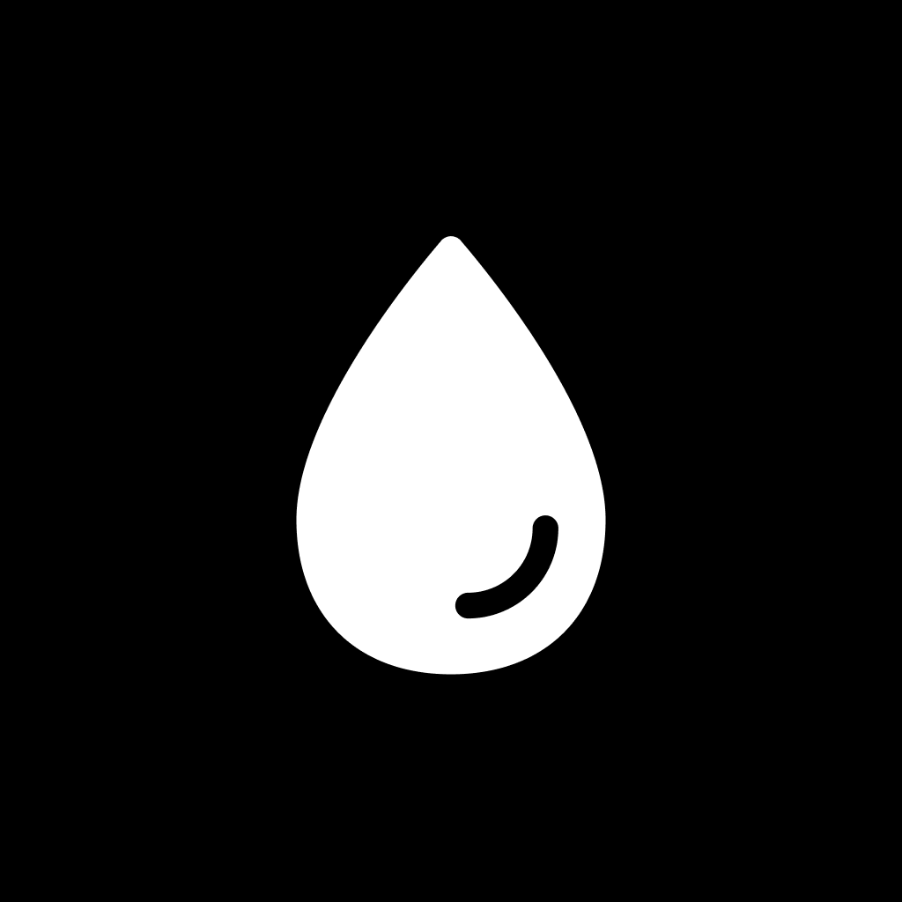

<p align="center">
  
</p>

<h1 align="center">Quench</h1>

<p align="center">
  <strong>Hydration tracking for iOS</strong>
</p>

<p align="center">
  Log water, see your progress over time, and stay on track with reminders—built with <a href="https://expo.dev">Expo</a> and <a href="https://docs.expo.dev/router/introduction/">Expo Router</a>.
</p>

---

## Features

- **Daily logging** — Quick entry and a clear picture of today’s intake  
- **Insights** — Trends and history so you can see patterns, not just numbers  
- **Apple Health** — Reads and writes water (and related signals like activity and weight where used for goals) via HealthKit on iOS  
- **Reminders** — Local notifications to nudge you when it helps  
- **Onboarding** — Guided first-run setup  

> **Note:** HealthKit and other native modules need a [development build](https://docs.expo.dev/develop/development-builds/introduction/) or a store build. [Expo Go](https://expo.dev/go) won’t include all of these capabilities.

## Requirements

- [Node.js](https://nodejs.org/) (LTS recommended)  
- [Xcode](https://developer.apple.com/xcode/) (iOS simulator / device)  

## Getting started

```bash
npm install
npm start
```

Then choose **iOS** from the dev server UI, or run:

```bash
npm run ios
```

## Scripts

| Script | Description |
|--------|-------------|
| `npm run lint` | Run Oxlint |
| `npm run lint:fix` | Fix lint issues where possible |
| `npm run format` | Format with Oxfmt |
| `npm run format:check` | Check formatting |
| `npm run check` | Lint + format check |

## Project structure

- **`app/`** — File-based routes (screens, layouts, onboarding)  
- **`assets/`** — Images and static assets (app icon: `assets/images/icon.png`)  
- **`components/`** — Shared UI  

## Learn more

- [Expo documentation](https://docs.expo.dev/)  
- [Expo Router](https://docs.expo.dev/router/introduction/)  

---

<p align="center">
  Built with Expo SDK 55 · React Native · TypeScript
</p>
